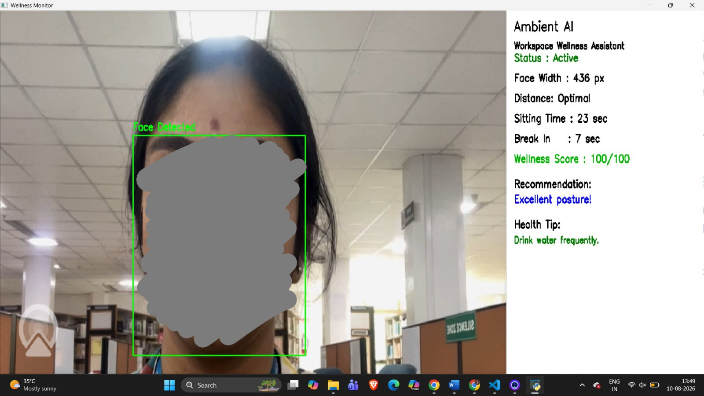

   # 🌱 WellSight AI
   
   ### AI-Powered Workspace Wellness Assistant
   
   WellSight AI is a real-time computer vision-based workspace wellness assistant designed to encourage healthier digital working habits.
   
   The system uses computer vision to monitor user presence, approximate face-to-camera distance, sitting duration and break intervals, and provides real-time wellness scores and recommendations.
   
   ---
   
   ## 🎯 Problem Statement
   
   Long periods of continuous computer usage can lead to poor workspace habits such as sitting too close to the screen and working for extended periods without taking breaks.
   
   WellSight AI aims to provide a simple, real-time monitoring system that encourages users to maintain healthier workspace habits.
   
   ---
   
   ## ✨ Features
   
   - 👤 Real-time user presence detection
   - 📏 Face-to-camera distance estimation
   - 🪑 Sitting-time monitoring
   - ⏱️ Break countdown and reminder
   - 🔔 Audio break alert
   - 📊 Real-time wellness score
   - 💡 Contextual wellness recommendations
   - 🧠 Computer vision-based monitoring
   - 📋 Excel-based session database
   
   ---
   
  ## 🧠 How It Works

```text
Webcam
   ↓
Face Detection
   ↓
Face Size Estimation
   ↓
Distance Classification
   ↓
Session & Break Monitoring
   ↓
Wellness Score
   ↓
Real-Time Recommendation

```

## 🖥️ Application Dashboard


---

## 🚀 Getting Started

### Prerequisites

- Windows operating system
- Python 3.10
- Webcam

### 1. Clone the repository

```bash
git clone https://github.com/Jayam-Parthiban/WellSight-AI.git
cd WellSight-AI
```

### 2. Install dependencies

```bash
py -3.10 -m pip install -r requirements.txt
```
### 3. Start the application

```bash
py -3.10 database.py
```

### 4. Enter user details

The application will ask for:

- User / Candidate Name
- Reference Number

The Wellness Monitor will then launch automatically.

### 5. Use the Wellness Monitor

The system provides real-time monitoring of:

- User presence
- Face-to-camera distance
- Sitting duration
- Break intervals
- Wellness score
- Wellness recommendations

Press **Q** in the Wellness Monitor window to finish the session.

The session information is then stored in the Excel database.


